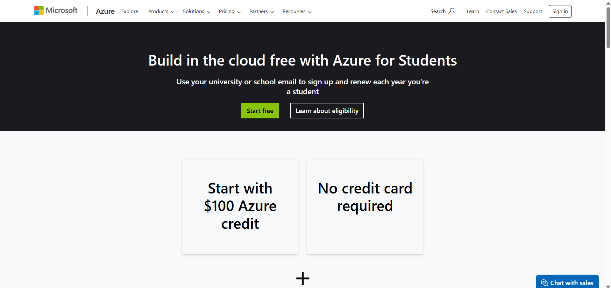
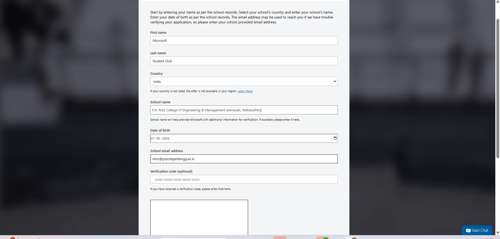
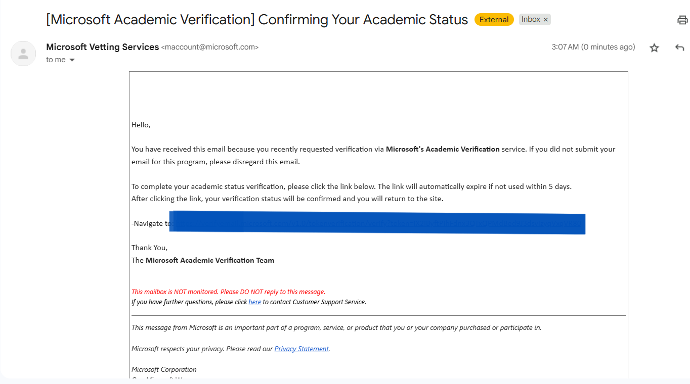
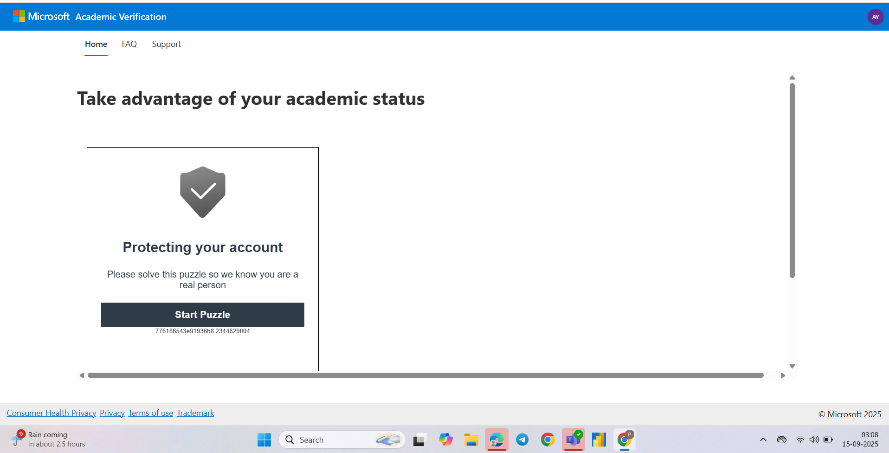
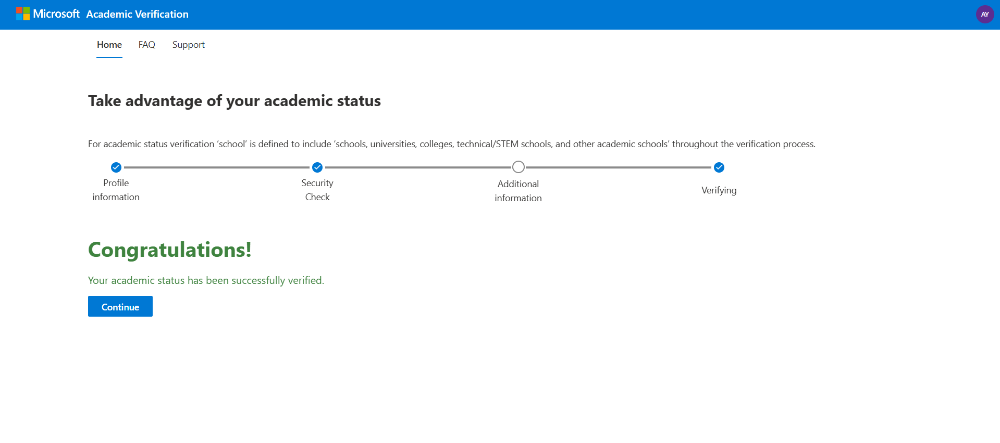
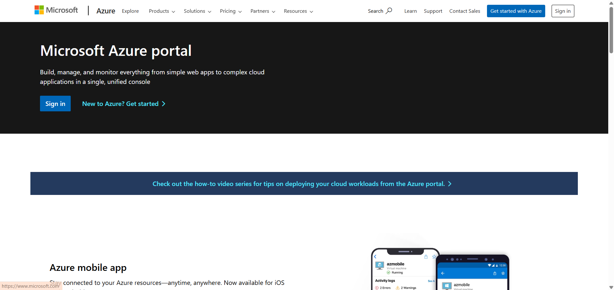
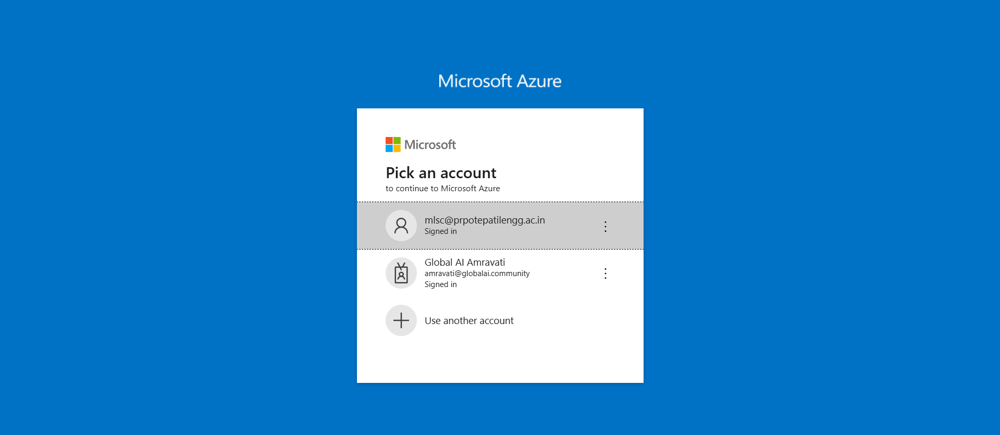
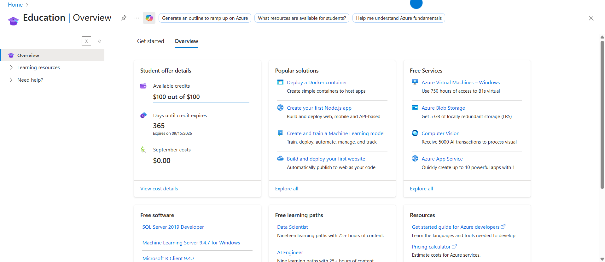

# Microsoft Azure for Students – Get $100 Free Credit Every Year

If you’re a student interested in **cloud computing, AI, or data science**, Microsoft Azure offers an amazing opportunity. With **Azure for Students**, you can receive **$100 in free Azure credits every year until you graduate** — no credit card required. This program lets you explore cloud services, build projects, and develop valuable technical skills at **zero cost**.

## Why Choose Azure for Students?

- **Free $100 yearly credit** – renewed annually while you’re enrolled.  
- **No credit card needed** – just a valid student email.  
- **Access to 55+ free services** – including Virtual Machines, Databases, and AI tools.  
- **Developer tools included** – GitHub Student Developer Pack, Visual Studio Code, and more.  
- **Skill-building opportunities** – learn cloud computing, AI, DevOps, and prepare for certifications.  

---

## Steps to Claim Your $100 Azure Credit

<table>
<tr>
<td>

**Step 1: Go to Azure for Students**  
Visit: [https://azure.microsoft.com/en-us/free/students](https://azure.microsoft.com/en-us/free/students)

</td>
<td>

</td>
</tr>

<tr>
<td>

**Step 2: Fill in Your Details**  
Enter your student information and college email ID.

</td>
<td>

</td>
</tr>

<tr>
<td>

**Step 3: Verify Your Email**  
Check your inbox for the verification email sent to your college email.

</td>
<td>

</td>
</tr>

<tr>
<td>

**Step 4: Complete Verification Puzzle**  
Solve the puzzle or verification step sent by Microsoft.

</td>
<td>

</td>
</tr>

<tr>
<td>

**Step 5: Congratulations!**  
Your Azure student account is successfully activated.

</td>
<td>

</td>
</tr>

<tr>
<td>

**Step 6: Go to Azure Portal**  
Visit [https://portal.azure.com/](https://portal.azure.com/) to access Azure services.

</td>
<td>

</td>
</tr>

<tr>
<td>

**Step 7: Sign in with Your College Email ID**  

</td>
<td>

</td>
</tr>

<tr>
<td>

**Step 8: Start Using Your $100 Credit**  
You now have the full **$100 credit available** to explore and build projects.

</td>
<td>

</td>
</tr>
</table>

---

## Follow for More Azure Guides

⭐ Follow [**mscprpcem**](https://github.com/mscprpcem) on GitHub for the next series of Azure tutorials and cloud tips for students!

